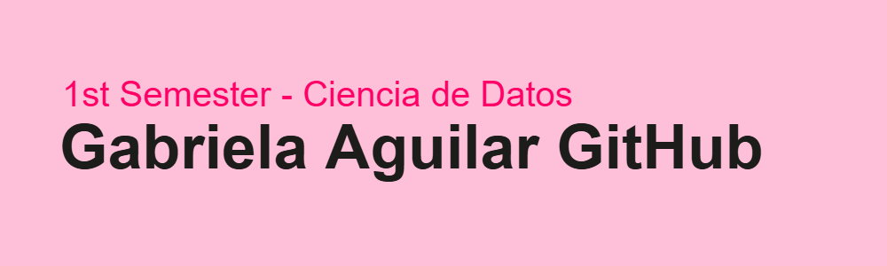

<h3>Welcome to my workspace on the track to become a Data Analyst - Universidad de Medellín 2025<h3>
¯`*•.¸,¤°´✿.｡.:*  *.:｡.✿`°¤,¸.•*´¯¯`*•.¸,¤°´✿.｡.:*  *.:｡.✿`°¤,¸.•*´¯¯`*•.¸,¤°´✿.｡.:*  *.:｡.✿`°¤,¸.•*´¯

<h2>My Repository Index</h2>
<h3> 1. <a href="https://github.com/gabrielaaguiv5/CS50-Introduction-to-Computer-Science">All excercises and projects for CS50: Introduction to Computer Science 2024</a> </h3>
<h3> 2. <a href="https://github.com/gabrielaaguiv5/CS50-Introduction-to-Computer-Science">Final Project for CS50: Introduction to Computer Science 2024</a> </h3> 
<h4>Chrome Extension:  
  Tab Sorter: Easing Navigation in Tab-Overloaded Scenarios.
</h4>

<h2>Current Work for Major on Data Analytics</h2>
<h2>Ciencia de Datos - Universidad de Medellín</h2>
<h3>Curriculum</h3>
<ul>
  <li>Introduction to Artificial Intelligence</li>
  <li>Programming Fundamentals</li>
  <li>Statistics Fundamentals</li>
  <li>Introduction to Data Science</li>
</ul>

